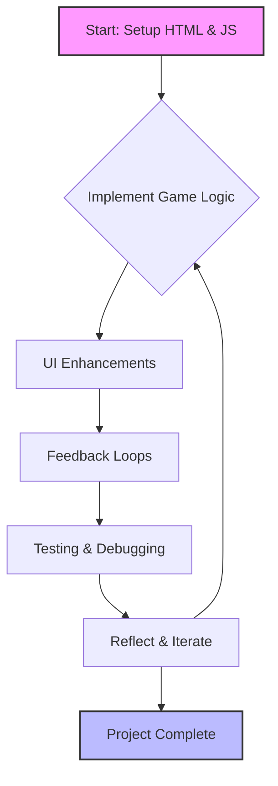

# Applying Agile Methodologies to Interactive Game Development: A Comprehensive Analysis

## Introduction to Agile in Small-Scale Projects

During this sprint cycle, I explored how **Agile development frameworks** can transform even modest coding projects into structured, user-centered learning experiences. My subject for this exploration was a browser-based Rock-Paper-Scissors game—a seemingly straightforward application that became a canvas for practicing professional software development workflows.

The beauty of applying Agile principles to personal projects lies not in the complexity of the final product, but in the **disciplined approach to problem-solving and continuous improvement**. By treating each enhancement as a deliberate iteration with measurable outcomes, I transformed what could have been a chaotic coding session into a thoughtful journey through the software development lifecycle.

---

## The Philosophy Behind Iterative Cycles

Traditional development approaches often encourage building everything at once—creating all features, styling, and functionality in one massive push. However, this method frequently leads to overlooked bugs, poor user experience decisions, and a final product that feels disconnected from actual user needs.

In contrast, the **Agile framework emphasizes incremental progress through repeated cycles of planning, implementation, evaluation, and refinement**. Each cycle represents a complete mini-project with its own objectives and success criteria. This approach offers several advantages:

- **Risk Mitigation:** Problems are identified when they're still small and manageable
- **Flexibility:** Priorities can shift based on what's learned in each iteration
- **Quality Focus:** Continuous testing ensures each component works before moving forward
- **User Alignment:** Frequent evaluation keeps the end-user experience at the forefront

For my Rock-Paper-Scissors project, this meant I could course-correct quickly when something didn't feel right, rather than discovering fundamental flaws only after hours of work.

---

## Detailed Breakdown of Development Iterations

### Phase One: Foundation and Core Mechanics

The initial sprint focused exclusively on establishing a **functional minimum viable product (MVP)**. I began by constructing the essential HTML framework, including a canvas element for potential future visualizations and a set of interactive control buttons that would serve as the primary user interface.

The core game engine was my first programming priority. I developed the fundamental logic that governs Rock-Paper-Scissors gameplay, initially routing all interactions through the browser's developer console. This decision was deliberate—by starting with console-based input and output, I could verify that the game mechanics worked perfectly before layering on more complex visual elements.

At this stage, my code included basic randomization for computer opponent moves, conditional logic to determine winners, and simple text-based feedback. The focus was entirely on **algorithmic correctness rather than aesthetic appeal**.

**Key Achievement:** A fully functional game that correctly determined outcomes for all possible player-computer combinations, even if the interface remained bare-bones.

### Phase Two: Visual Communication and User Interface Design

With solid mechanics in place, the second iteration concentrated on **transforming the functional game into an engaging user experience**. This is where design thinking intersected with technical implementation.

I created a comprehensive instructions panel that didn't just tell users how to play—it showed them. By incorporating images alongside text explanations, I addressed different learning styles and reduced the cognitive load required to understand the game. The visual guide walked players through each possible move and its corresponding hand gesture, creating an intuitive connection between the digital interface and the familiar physical game.

Additionally, I introduced an "Inspect Me" feature—a button that actively encouraged users to open their browser's developer tools and explore the underlying HTML structure. This educational element transformed the game from mere entertainment into a **learning tool that demystifies web development** for curious players.

**Key Achievement:** A polished, accessible interface that welcomed both casual players and aspiring developers interested in understanding how browser games function.

### Phase Three: Dynamic Feedback Systems

The third cycle addressed a critical aspect of user experience: **immediate, meaningful feedback**. Games thrive on the principle of action-reaction loops, where every player decision generates a clear, satisfying response.

I implemented a results display system that dynamically updated after each round, showing not just who won, but exactly what choices both the player and computer made. This transparency builds trust and helps players understand the game's logic rather than feeling like outcomes are arbitrary.

Beyond text feedback, I added visual enhancements to the player's chosen option—highlights, animations, or style changes that confirmed their selection had registered. This tactile responsiveness is crucial for creating a sense of agency and control, making the digital experience feel more tangible and rewarding.

**Key Achievement:** A responsive feedback loop that made every interaction feel purposeful and every outcome feel earned, significantly improving player engagement and satisfaction.

### Phase Four: Quality Assurance and Refinement

The final development iteration focused on **systematic testing and polish**. I conducted extensive playtesting, deliberately seeking out edge cases and unusual interaction patterns that might expose weaknesses in my code.

Some scenarios I tested included:
- Playing identical choices repeatedly to ensure randomization worked properly
- Attempting to interact with elements in unexpected orders
- Viewing the game on different screen sizes to verify responsive design

Based on these tests, I made numerous small adjustments—tweaking CSS for better readability, adjusting timing on animations to feel more natural, and clarifying certain instructional language that proved confusing during self-testing.

**Key Achievement:** A stable, reliable game that handled all reasonable (and several unreasonable) user interactions gracefully, with visual clarity across different viewing contexts.

---

## Code Implementation Examples

### Structural HTML for Game Interface

The HTML foundation provides the skeleton upon which all interactive elements rest:

```html
<!-- filepath: /home/nithi/student/assets/rps.html -->
<div id="game">
  <button onclick="play('rock')"> Rock</button>
  <button onclick="play('paper')">Paper</button>
  <button onclick="play('scissors')">Scissors</button>
  <div id="result"></div>
</div>
```

This structure demonstrates **semantic clarity**—each element has a single, well-defined purpose. The buttons trigger specific game actions, while the result div serves as a designated space for outcome information. This separation of concerns makes the code maintainable and easy to modify in future iterations.

### Functional JavaScript Game Engine

The JavaScript implementation handles all game logic through a single, elegant function:

```js
// filepath: /home/nithi/student/assets/rps.js
function play(playerChoice) {
  const choices = ['rock', 'paper', 'scissors'];
  const computerChoice = choices[Math.floor(Math.random() * 3)];
  let result = '';
  if (playerChoice === computerChoice) {
    result = "It's a tie!";
  } else if (
    (playerChoice === 'rock' && computerChoice === 'scissors') ||
    (playerChoice === 'paper' && computerChoice === 'rock') ||
    (playerChoice === 'scissors' && computerChoice === 'paper')
  ) {
    result = 'You win!';
  } else {
    result = 'You lose!';
  }
  document.getElementById('result').innerText =
    `You chose ${playerChoice}, computer chose ${computerChoice}. ${result}`;
}
```

This function exemplifies **clean, readable code** that accomplishes multiple tasks efficiently: generating computer moves, evaluating win conditions, and updating the user interface—all within a compact, understandable structure.

---

## Visualizing the Agile Workflow



This diagram illustrates the **cyclical nature of Agile development**. Notice how the reflection stage can either loop back to game logic for further refinement or proceed to project completion. This flexibility is central to Agile methodology—knowing when to iterate further and when to recognize that a feature is genuinely finished.

---

## Sprint Planning Techniques for Individual Projects

Even though this was a solo endeavor without traditional stakeholders, I structured my work using **formal sprint planning methodologies**. This discipline provided clarity and purpose to each coding session.

### Defining User Stories

I began each sprint by articulating clear user stories that described desired functionality from the player's perspective:

**Primary User Story:** "As a player discovering this game for the first time, I want to immediately understand the rules and receive clear feedback on my choices, so that I can enjoy playing without frustration or confusion."

This user story became my north star, guiding every design and implementation decision throughout the project.

### Breaking Down Tasks

From this overarching story, I derived specific, actionable tasks:

- Develop console-accessible game commands that accept player input
- Implement visual highlighting effects that confirm which option the player selected
- Design and code a dedicated results display area with readable typography
- Create interactive elements that encourage technical exploration of the HTML structure
- Conduct cross-browser testing to ensure consistent behavior

Each task was **small enough to complete in a single focused work session** yet substantial enough to represent meaningful progress toward the final goal. This granularity prevented overwhelm and provided regular opportunities to celebrate small victories.

### Measuring Progress

After completing each task, I evaluated its success against specific criteria:
- Does the feature work reliably across multiple test cases?
- Does it enhance user understanding or enjoyment?
- Is the code maintainable and well-commented for future reference?
- Does it align with the broader user story?

This **systematic evaluation ensured quality remained high** even as I moved quickly through iterations.

---

## Learning Experience Design Principles in Practice

My approach to this project was heavily influenced by **Learning Experience Design (LxD)** principles, which emphasize creating educational experiences that are engaging, effective, and learner-centered.

### Prioritizing User Understanding

Rather than simply making a game that worked, I focused on making a game that *taught* users something—whether that was how to play Rock-Paper-Scissors, how HTML buttons trigger JavaScript functions, or how web developers structure interactive applications.

Every design choice was filtered through the question: **"Will this help the user understand what's happening?"** This led to decisions like:
- Using emoji in button labels to create visual associations
- Displaying both player and computer choices explicitly rather than just showing "You win/lose"
- Adding the "Inspect Me" button to lower barriers to technical exploration

### Creating Engaging Feedback Mechanisms

LxD emphasizes that **learning happens most effectively when there's immediate, meaningful feedback**. In game design, this translates to players always knowing what their actions accomplished and why certain outcomes occurred.

My feedback systems provided multiple layers of information:
- Visual confirmation (highlighted selection)
- Textual explanation (displaying specific choices)
- Outcome declaration (clear win/lose/tie statement)

This redundancy ensured that users with different preferences or abilities could all access the information they needed to understand the game state.

### Supporting Progressive Exploration

The "Inspect Me" feature represents a **scaffolded approach to technical learning**. Rather than requiring users to know about developer tools beforehand, it explicitly invites exploration and provides a clear pathway for curious users to dive deeper into the technical implementation.

This transforms the game from a closed black box into an **open invitation to learn**, aligning perfectly with LxD principles of empowering learners to direct their own educational journeys.

---

## Flexibility and Responsive Decision-Making

One of Agile's greatest strengths is its embrace of **adaptive planning over rigid adherence to initial plans**. Several times during development, I made significant pivots based on what I learned in earlier iterations.

### Reprioritizing Visual Feedback

Initially, I planned to expand the console-based interaction system with more sophisticated text commands. However, after implementing basic visual highlights, I realized they provided far more immediate value to most users. 

Rather than sticking to my original plan, I **shifted priorities to enhance visual feedback systems** first, postponing or eliminating certain console features that would only appeal to a narrow technical audience. This decision significantly improved the game's accessibility and appeal.

### Simplifying Before Complicating

At one point, I considered adding score tracking, round histories, and competitive mode features. However, reflecting on my user story, I realized these additions might actually detract from the core experience of learning and exploration.

Instead of feature creep, I made the **conscious choice to perfect the simple, core gameplay loop**. This restraint resulted in a more focused, polished product than I would have achieved by adding numerous half-baked features.

---

## Reflections on Methodology and Future Applications

### The Value of Structure in Creative Work

Before applying Agile principles, I might have approached this project haphazardly—coding whatever seemed interesting in the moment without a coherent plan. The structured approach forced me to **think strategically about priorities and user needs** from the outset.

This didn't stifle creativity; rather, it **provided a framework within which creativity could flourish**. Knowing I had space for future iterations freed me to make bold choices in early phases, confident I could refine them later based on actual results rather than speculation.

### Transferable Skills for Professional Development

While this was a personal project, the workflows I practiced mirror those used in professional software teams:
- Breaking work into manageable sprints
- Defining clear success criteria before beginning work
- Conducting regular retrospectives to identify improvement opportunities
- Prioritizing user needs over technical preferences

These habits will serve me well in collaborative environments where **clear communication and systematic progress tracking are essential**.

### Continuous Improvement Mindset

Perhaps most importantly, working in Agile cycles instilled a **continuous improvement mindset**. Rather than viewing the project as "done" after the first working version, I naturally began asking: "How could this be better? What's the next most valuable enhancement?"

This perspective transforms development from a finish-line sprint into an **ongoing journey of refinement and learning**—an attitude that will benefit any future coding endeavors.