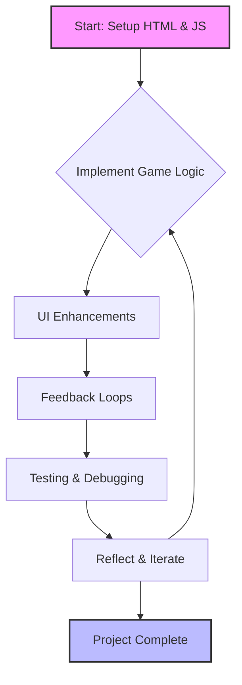

# Applying Agile Methodologies: A Practical Approach

## Introduction to Agile in Personal Projects

During this sprint, I explored how **Agile development frameworks** can transform even small coding projects into structured, user-centered learning experiences. My Rock-Paper-Scissors game became a canvas for practicing professional software development workflows through iterative cycles of planning, implementation, and refinement.

The beauty of applying Agile principles to personal projects lies in the **disciplined approach to problem-solving and continuous improvement**. By treating each enhancement as a deliberate iteration with measurable outcomes, I transformed chaotic coding sessions into thoughtful journeys through the software development lifecycle.

---

## Development Iterations

### Phase One: Foundation and Core Mechanics

The initial sprint focused on establishing a **functional minimum viable product (MVP)**. I built the essential HTML framework and game engine, initially routing interactions through the browser console. This allowed me to verify game mechanics worked perfectly before adding visual complexity.

**Key Achievement:** A fully functional game with correct win/loss logic for all possible combinations.

### Phase Two: User Interface Design

The second iteration transformed the functional game into an engaging experience. I created comprehensive instructions with visual guides and added an "Inspect Me" feature that encouraged users to explore the underlying code structure.

**Key Achievement:** A polished, accessible interface that served both casual players and aspiring developers.

### Phase Three: Dynamic Feedback Systems

I implemented a results display system showing both player and computer choices, plus visual enhancements confirming user selections. This **immediate feedback loop** made every interaction feel purposeful and rewarding.

**Key Achievement:** Responsive feedback that significantly improved player engagement and satisfaction.

### Phase Four: Quality Assurance

The final iteration focused on systematic testing and polish—handling edge cases, refining animations, and ensuring cross-browser compatibility.

**Key Achievement:** A stable, reliable game that handled all user interactions gracefully.

---

## Sprint Planning for Solo Work

### Defining User Stories

I began each sprint with clear user stories from the player's perspective:

**Primary User Story:** "As a player discovering this game for the first time, I want to immediately understand the rules and receive clear feedback on my choices, so that I can enjoy playing without frustration."

This guided every design and implementation decision throughout the project.

### Breaking Down Tasks

From the user story, I derived specific, actionable tasks:
- Develop console-accessible game commands
- Implement visual highlighting effects
- Design dedicated results display area
- Create interactive exploration elements
- Conduct cross-browser testing

Each task was **small enough to complete in one focused session** yet substantial enough to represent meaningful progress.

### Measuring Progress

After completing each task, I evaluated success against criteria:
- Does the feature work reliably across test cases?
- Does it enhance user understanding or enjoyment?
- Is the code maintainable and well-commented?
- Does it align with the broader user story?

---

## Agile Workflow Visualization

This diagram illustrates the **cyclical nature of Agile development**—knowing when to iterate further and when to recognize a feature is genuinely finished.

---

## Responsive Decision-Making

### Reprioritizing Visual Feedback

Initially, I planned extensive console-based interactions. However, after implementing basic visual highlights, I realized they provided far more immediate value. I **shifted priorities to enhance visual feedback systems** first, significantly improving accessibility and appeal.

### Avoiding Feature Creep

I considered adding score tracking, round histories, and competitive modes. But reflecting on my user story, these might detract from the core learning experience. Instead, I made the **conscious choice to perfect the simple gameplay loop**, resulting in a more focused, polished product.

---

## Version Control Integration

### Strategic Git Practices

Throughout development, I maintained **rigorous version control practices** that transformed Git from a backup system into a powerful development tool. Each commit represented a discrete, functional improvement.

My commit strategy followed key principles:

**Atomic Commits:** Each addressed a single concern—adding a feature, fixing a bug, or improving styling.

**Descriptive Messages:** Specific messages explaining both what changed and why.

**Logical Sequencing:** Commits built naturally on previous ones, creating a readable narrative.

Notable commits:
- **"feat: add toggleable content sections"** - Established conventions for event handling
- **"fix: correct button click event handling"** - Refined timing of script execution
- **"style: improve layout and spacing"** - Recognized that presentation impacts usability

---

## Key Reflections

### The Value of Structure

The structured Agile approach forced me to **think strategically about priorities and user needs** from the outset. It provided a framework where creativity could flourish while maintaining focus on delivering value.

### Transferable Professional Skills

The workflows I practiced mirror those in professional software teams:
- Breaking work into manageable sprints
- Defining clear success criteria
- Conducting regular retrospectives
- Prioritizing user needs over technical preferences

### Continuous Improvement Mindset

Working in Agile cycles instilled a **continuous improvement mindset**. Rather than viewing the project as "done" after the first version, I naturally began asking: "How could this be better?"

This perspective transforms development from a finish-line sprint into an **ongoing journey of refinement and learning**—an attitude that will benefit all future coding endeavors.

---

## Conclusion

Agile methodology isn't just for large teams—it's a powerful framework for any developer seeking structured, user-centered development. The key is adopting principles that work for your context and continuously refining your process.

By applying Agile to my personal projects, I learned that **systematic iteration beats random changes**, **user focus beats technical cleverness**, and **reflection drives continuous growth**.