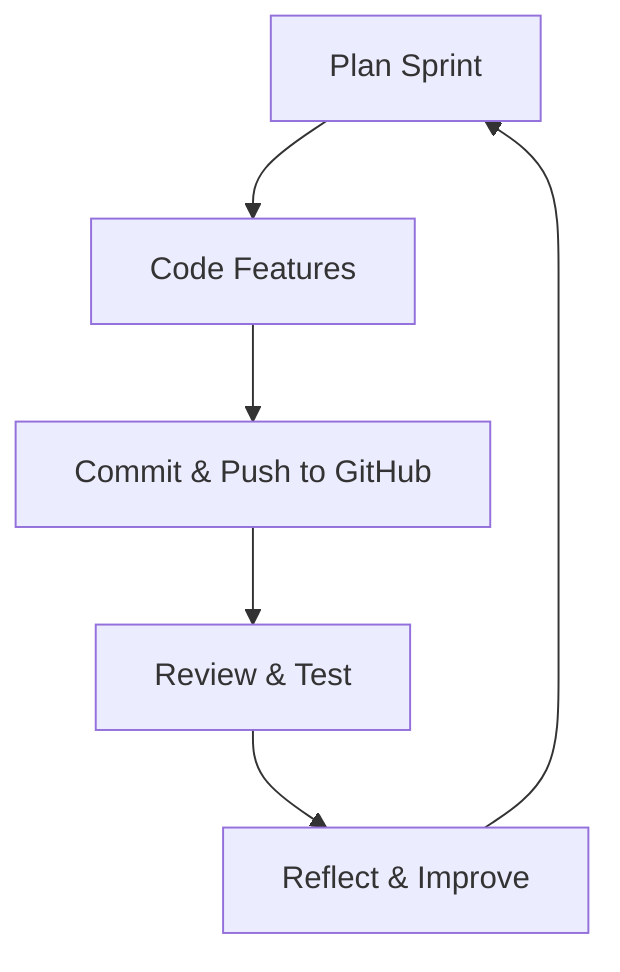

## Agile Setup
My agile workflow is designed to maximize productivity, collaboration, and continuous improvement. I use VSCode as my primary coding environment, enhanced with extensions for GitHub integration, code linting, and formatting. This setup allows me to quickly switch between tasks, review code, and maintain high standards for code quality. 

For version control, I rely on GitHub repositories to manage my codebase. I create branches for new features or bug fixes, make regular commits, and use pull requests for code reviews. This process not only keeps my work organized but also makes it easy to collaborate with peers and track changes over time. 

Automation is a key part of my workflow. I use Makefile scripts to automate repetitive tasks such as building, testing, and deploying my projects. This reduces manual errors and saves time, allowing me to focus on solving problems and developing new features. 

Task management is handled through a Kanban board, where I break down my work into manageable sprints. Each sprint begins with planning, where I set clear goals and prioritize tasks. During the sprint, I focus on coding and implementing features, making sure to commit and push changes regularly. At the end of each sprint, I review my progress, test the new features, and reflect on what went well and what could be improved. This cycle of planning, execution, review, and reflection helps me continuously improve my workflow and deliver better results.

**Tools Used:**
- VSCode (with extensions for GitHub, linting, and formatting)
- GitHub repository for commits, branches, and pull requests
- Makefile for automating build and test commands
- Kanban board for task management
- Markdown for documentation and tracking progress
- Mermaid for visualizing workflows and processes

## Personal Experience
Adopting agile practices has transformed the way I approach projects. By breaking work into sprints and focusing on incremental progress, I am able to stay motivated and avoid feeling overwhelmed. The use of automation and version control has made my workflow more efficient and reliable, while regular reviews and reflections ensure that I am always learning and improving. Collaboration with peers has also become easier, as clear documentation and organized code make it simple to share ideas and work together on complex problems.

## Agile Workflow Flowchart
