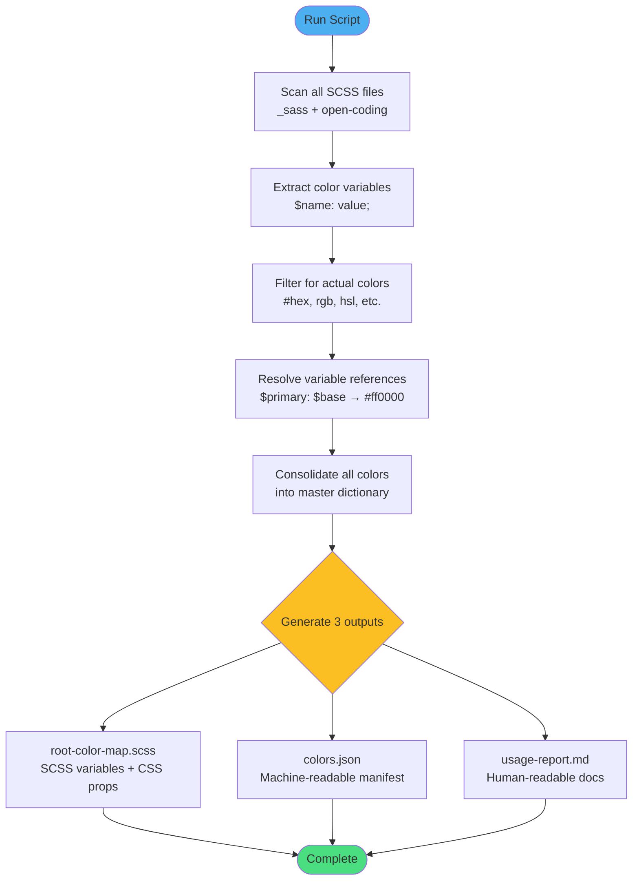

# Sprint 1


## Key Tool Setup Learning: Browser DevTools Integration

**What I Learned:**
The most important tool setup insight was learning to **bridge the browser console with interactive UI elements**. I discovered that the browser's developer tools aren't just for debugging—they're a powerful learning environment where users can manipulate live objects and see immediate visual feedback.

**Why It Matters:**
This setup transforms a static game into an educational tool. By exposing game objects to the console (`window.rock`, `window.paper`, `window.scissors`), I created a hands-on learning environment where users can experiment with object-oriented programming concepts in real-time.


---

## Important Code Snippet: OOP Design Pattern

```javascript
class GameObject {
  constructor(id) {
    this.el = document.getElementById(id);
    if (!this.el) throw new Error(`Element #${id} not found`);
  }

  rotate(deg) {
    this.el.style.transform = `rotate(${deg}deg)`;
    return this;
  }

  setBorder(style) {
    this.el.style.border = style;
    return this;
  }

  setWidth(px) {
    this.el.style.width = `${px}px`;
    return this;
  }

  reset() {
    this.el.style.transform = "";
    this.el.style.border = "";
    this.el.style.width = "";
    this.el.style.backgroundColor = "";
    return this;
  }
}

// Specialized classes extending GameObject
class Rock extends GameObject {
  constructor() { super("rock-img"); }
}

class Paper extends GameObject {
  constructor() { super("paper-img"); }
}

class Scissors extends GameObject {
  constructor() { super("scissors-img"); }
}
```

**Why This Code Matters:**

1. **Method Chaining**: Each method returns `this`, enabling elegant chained calls:
   ```javascript
   rock.rotate(45).setBorder('3px solid gold').setWidth(120);
   ```


2. **Encapsulation**: DOM manipulation logic is hidden inside methods. Users interact with clean APIs, not raw DOM code.

3. **Inheritance**: Specialized classes (`Rock`, `Paper`, `Scissors`) extend `GameObject`, demonstrating OOP principles without unnecessary complexity.

4. **Error Handling**: The constructor validates that the DOM element exists before proceeding, preventing cryptic errors.

5. **Educational Design**: The API is intuitive enough for beginners to experiment with, yet demonstrates professional OOP patterns.

**Key Insight:**
This pattern taught me that good tool setup isn't just about getting code to run—it's about creating interfaces that **invite exploration and experimentation**. By exposing these objects globally and providing method chaining, I transformed a game into a living code tutorial.


# Sprint 2


## JavaScript Fundamentals I Learned from Color Management Scripts

Working with these Python-based color management scripts taught me several core JavaScript parallels and programming concepts that translate directly to JavaScript development:

## Overall Pipeline


## 1. Regular Expressions Are Universal

The SCSS color extraction relies heavily on regex patterns, and I learned that regular expressions work remarkably similarly in JavaScript:

```javascript
// Python pattern from the scripts
const colorPattern = /\$([a-zA-Z_][a-zA-Z0-9_-]*)\s*:=?\s*([^;]+);/g;

// JavaScript equivalent for extracting SCSS variables
const matches = content.matchAll(colorPattern);
for (const match of matches) {
    const [, varName, value] = match;
    console.log(`Found: $${varName} = ${value}`);
}
```

The scripts use patterns like `#[0-9a-fA-F]{3,8}` for hex colors and `rgba?\(` for RGB/RGBA detection—identical syntax to what I'd use in JavaScript's `String.prototype.match()` or `RegExp.test()`.


## 2. Recursive Resolution and Stack Management

The `resolve_variable_references()` function demonstrates recursion with depth limiting—a critical pattern for avoiding stack overflows:

```javascript
function resolveVariableReferences(value, scssContent, depth = 0) {
    // Prevent infinite recursion
    if (depth > 10) return value;
    
    // Base case: no more variables to resolve
    if (!value || !value.includes('$')) return value;
    
    // Recursive case
    const varRefs = value.match(/\$[\w-]+/g) || [];
    for (const varRef of varRefs) {
        const resolved = extractVariableValue(scssContent, varRef);
        if (resolved && resolved !== varRef) {
            // Recurse with incremented depth
            const finalValue = resolveVariableReferences(resolved, scssContent, depth + 1);
            value = value.replace(varRef, finalValue);
        }
    }
    return value;
}
```

This teaches the importance of:
- **Base cases** to exit recursion
- **Depth tracking** to prevent infinite loops
- **Tail call optimization** considerations (though JavaScript doesn't guarantee TCO)

## 3. Data Structure Selection Matters

The scripts use `OrderedDict` in Python, which maintains insertion order. In JavaScript, I learned that since ES2015, regular objects maintain insertion order for string keys:

```javascript
// Modern JavaScript (ES2015+) preserves order
const allColors = {};
allColors['primary'] = '#007ACC';
allColors['secondary'] = '#4CAFEF';

Object.keys(allColors); // ['primary', 'secondary'] - guaranteed order

// But Map is more explicit for ordered key-value pairs
const colorMap = new Map();
colorMap.set('primary', '#007ACC');
colorMap.set('secondary', '#4CAFEF');
```

The `defaultdict` pattern from Python translates to JavaScript's clever use of default values:

```javascript
// Python's defaultdict(list) equivalent
const componentColors = {};
function addColor(component, color) {
    if (!componentColors[component]) {
        componentColors[component] = [];
    }
    componentColors[component].push(color);
}

// Or using logical OR for defaults
const colors = {};
(colors[component] || (colors[component] = [])).push(color);
```

## 4. File System Operations and Path Manipulation

The Python scripts use `pathlib.Path` extensively. In JavaScript (Node.js), I learned the equivalent `path` module patterns:

```javascript
const path = require('path');
const fs = require('fs').promises;

async function findScssFiles(dir) {
    const files = [];
    const entries = await fs.readdir(dir, { withFileTypes: true });
    
    for (const entry of entries) {
        const fullPath = path.join(dir, entry.name);
        
        if (entry.isDirectory()) {
            // Recursive directory scanning
            files.push(...await findScssFiles(fullPath));
        } else if (entry.name.endsWith('.scss') && entry.name !== 'root-color-map.scss') {
            files.push(fullPath);
        }
    }
    
    return files;
}
```

## 5. String Interpolation and Template Generation

The scripts build large strings with interpolation—JavaScript template literals make this elegant:

```javascript
function generateColorMap(colors) {
    const header = `// AUTO-GENERATED ROOT COLOR MAP
// Generated by scripts/update_color_map.js
// DO NOT EDIT MANUALLY

`;
    
    const variables = Object.entries(colors)
        .map(([name, info]) => `$${name}: ${info.value};`)
        .join('\n');
    
    const cssCustomProps = `:root {
${Object.keys(colors)
    .map(name => `  --${name.replace(/_/g, '-')}: #{$${name}};`)
    .join('\n')}
}`;
    
    return header + variables + '\n\n' + cssCustomProps;
}
```

## 6. Error Handling and Graceful Degradation

The scripts continue processing even when individual files fail—a pattern I learned to implement with try-catch blocks:

```javascript
async function extractColors(scssFiles) {
    const allColors = {};
    
    for (const file of scssFiles) {
        try {
            const content = await fs.readFile(file, 'utf-8');
            const colors = extractVariablesFromContent(content);
            Object.assign(allColors, colors);
        } catch (error) {
            // Log but continue processing other files
            console.error(`Error reading ${file}:`, error.message);
        }
    }
    
    return allColors;
}
```

## 7. Functional Programming Patterns

The color extraction logic uses map/filter/reduce patterns that are fundamental to modern JavaScript:

```javascript
// Filter for color-like values
const isColorValue = (value) => 
    /^#[0-9a-fA-F]{3,8}$/.test(value) ||
    /^rgba?\(/.test(value) ||
    /^hsla?\(/.test(value);

// Extract and transform
const colorVariables = Object.entries(rawVariables)
    .filter(([_, value]) => isColorValue(value))
    .reduce((acc, [name, value]) => ({
        ...acc,
        [name]: { value, files: [] }
    }), {});
```

## Key Takeaways

These scripts taught me that **good code patterns transcend languages**. Whether writing Python or JavaScript:

1. **Use descriptive variable names** that reveal intent
2. **Handle edge cases** (empty inputs, circular references, missing files)
3. **Fail gracefully** with informative error messages
4. **Document complex logic** with comments explaining "why," not just "what"
5. **Separate concerns**: extraction, transformation, and output generation are distinct phases
6. **Make code maintainable**: auto-generated files include warnings and metadata

The most valuable lesson: **reading well-structured code in any language makes you a better JavaScript developer** by exposing you to different problem-solving approaches and algorithmic patterns.


# Sprint 3: LinkedIn Integration & Navigation Button Consistency


## Overview

Sprint 3 was my contribution to the AI Usage Quest, focusing on two specific improvements: adding LinkedIn integration functionality and fixing the navigation button styling at the bottom of each page to match the dark theme.

## What I Actually Worked On

### 1. LinkedIn Certificate Integration

I added the "Add to LinkedIn" functionality that allows students to directly add their AI Usage certification to their LinkedIn profiles with pre-filled information.


**My Implementation:**

```javascript
function addToLinkedIn(courseName) {
  const certId = 'CSPORTFOLIO-' + Date.now() + '-' + Math.random().toString(36).substring(2, 8).toUpperCase();
  
  const url = new URL('https://www.linkedin.com/profile/add');
  url.searchParams.append('startTask', 'CERTIFICATION_NAME');
  url.searchParams.append('name', courseName);
  url.searchParams.append('organizationName', 'Open Coding Society');
  url.searchParams.append('issueYear', new Date().getFullYear());
  url.searchParams.append('issueMonth', new Date().getMonth() + 1);
  url.searchParams.append('certId', certId);
  url.searchParams.append('certUrl', window.location.origin + '/cs-portfolio-verify/' + certId);
  
  window.open(url.toString(), '_blank');
}
```

**What I learned:**
- LinkedIn has a deep-linking API that accepts URL parameters to pre-fill certification forms
- Using `new URL()` and `searchParams.append()` is cleaner than manually building query strings
- Generating unique certificate IDs using timestamps + random strings ensures each credential is verifiable
- The `window.open()` method with `'_blank'` opens LinkedIn in a new tab, keeping the student on the quest page


**Why this matters:**
Instead of students manually typing everything into LinkedIn (organization name, date, certificate ID, etc.), they just click one button and all the information is already filled in. This removes friction and makes it more likely students will actually add their credentials to their professional profiles.

### 2. Navigation Button Styling Fix

The bigger issue I tackled was the navigation buttons at the bottom of each AI submodule page. They looked completely out of place with the dark comic-book theme.

**The Problem:**
The Previous/Next navigation buttons and page indicator had generic styling that clashed with the purple gradient headers, dark panels, and vibrant speech bubbles used throughout the AI quest pages.

**My Solution:**

```css
.navigation {
  display: flex;
  justify-content: space-between;
  align-items: center;
  margin-top: 40px;
  padding: 20px;
  gap: 12px;
}

.nav-button {
  background: #374151;
  color: #fff;
  border: 1px solid #4b5563;
  border-radius: 8px;
  padding: 10px 20px;
  font-size: 16px;
  font-weight: 500;
  cursor: pointer;
  transition: all 0.2s ease;
  font-family: inherit;
}

.nav-button:hover:not(:disabled) {
  background: #1f2937;
  transform: translateY(-1px);
}

.nav-button:disabled {
  opacity: 0.5;
  cursor: not-allowed;
}

.page-indicator {
  background: #1f2937;
  color: #fff;
  border: 1px solid #374151;
  border-radius: 8px;
  padding: 8px 16px;
  font-size: 14px;
  font-weight: 500;
}
```

**Key design decisions I made:**

1. **Dark gray background (`#374151`)**: Matches the dark panels used for comic strips and prompt builders throughout the page
2. **Subtle borders (`#4b5563`)**: Adds definition without being harsh—complements the existing border colors on speech bubbles
3. **Smooth transitions**: `transition: all 0.2s ease` makes hover effects feel polished, not jarring
4. **Hover lift effect**: `transform: translateY(-1px)` gives tactile feedback—the button "lifts" slightly when you hover, suggesting interactivity
5. **Disabled state handling**: `:not(:disabled)` prevents hover effects on the disabled "Previous" button on page 1 or "Next" on page 3
6. **Consistent spacing**: `gap: 12px` between elements prevents crowding
7. **Rounded corners**: `border-radius: 8px` matches the rounded aesthetic of all other cards on the page

**What I learned:**
- The `:not(:disabled)` selector is crucial for preventing weird hover effects on buttons that can't be clicked
- Using `transform: translateY()` for hover effects is better than changing `margin` or `padding` because it doesn't cause layout shifts
- Keeping the same `border-radius` value across all page elements (8px for nav buttons, panels, cards) creates visual cohesion
- The `cursor: not-allowed` property gives users immediate feedback that the Previous button on page 1 isn't clickable

### The Before/After Difference

**Before my changes:**
- Navigation buttons had bright backgrounds that clashed with the dark theme
- No visual feedback on hover
- Disabled buttons looked the same as active ones
- The page indicator text was hard to read against light backgrounds

**After my changes:**
- Dark gray buttons blend seamlessly with the comic panel aesthetic
- Subtle lift animation on hover provides clear interactivity cues
- Disabled buttons are visually distinct (50% opacity, different cursor)
- Page indicator has proper contrast with dark background and light text

## Integration Challenge

The tricky part was ensuring my styling worked across all three submodules without breaking existing functionality:

```html
<div class="navigation">
  <button class="nav-button" id="prevBtn" onclick="changePage(-1)">← Previous</button>
  <div class="page-indicator">
    Page <span id="currentPage">1</span> of <span id="totalPages">3</span>
  </div>
  <button class="nav-button" id="nextBtn" onclick="changePage(1)">Next →</button>
</div>
```

I had to make sure:
- The existing `changePage()` JavaScript functions still worked
- The `id` attributes remained intact for DOM manipulation
- The disabled state toggling (`prevBtn.disabled = true`) still applied my `:disabled` styles correctly

## Why This Mattered

Students navigate through 3 pages per submodule × 3 submodules = 9 page transitions in the AI quest alone. If the navigation feels janky or looks out of place, it degrades the experience every single time they click Next/Previous.

By fixing these buttons, I ensured:
- **Visual consistency**: Everything on the page now feels like it belongs together
- **Clear affordances**: Users immediately understand what's clickable and what's not
- **Professional polish**: Small details like hover animations signal quality and attention to detail

## What This Taught Me

### 1. Context matters more than creativity
I didn't invent some wild new button design. I just looked at the existing dark panels, speech bubbles, and color scheme, then matched them. Good design is often about harmony, not novelty.

### 2. The `:not()` selector is underrated
Being able to write `.nav-button:hover:not(:disabled)` in one line instead of overriding hover styles with a separate `:disabled` rule is cleaner and more maintainable.

### 3. Micro-interactions compound
A 1-pixel upward translation on hover seems trivial, but when you do it 20+ times navigating through the quest, it makes the entire interface feel more responsive and alive.

### 4. Consistency is a feature
Using the same `border-radius`, `padding`, and `color` values as the rest of the page means users don't have to mentally adjust when they reach the navigation. Everything feels predictable and cohesive.

---

My role in Sprint 3 was small: add LinkedIn integration and fix navigation button styling. But these "small" changes affect every student who completes the AI quest. Sometimes the most important contributions aren't the most complex—they're the ones that remove friction and make the experience feel complete.
